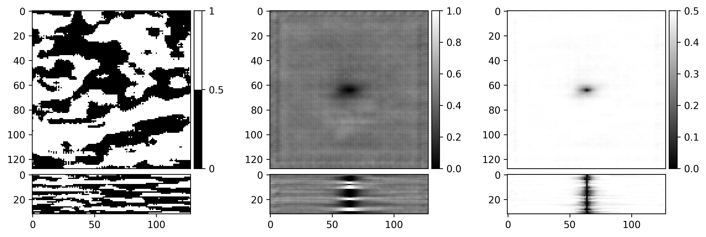

## GeoGAN: Conditioning of three-dimensional generative adversarial networks for pore and reservoir-scale models

This is the code repository accompanying the publication:
 *Conditioning of three-dimensional generative adversarial networks for pore and reservoir-scale models*
 [[ArXiv]()]

## Datasets and pre-trained models

### Ketton Limestone Dataset
We provide two pre-trained GAN models. The first one is trained on the Ketton limestone training image presented here
If you decide to use this dataset for your own work, please consider citing the following works:

*Stochastic reconstruction of an oolitic limestone by generative adversarial networks*[[ArXiv](https://arxiv.org/abs/1712.02854)]
*Dynamic reservoir-condition microtomography of reactive transport in complex carbonates*[[Article](https://www.sciencedirect.com/science/article/pii/S0016703717300789)]

Due to their size we provide the necessary files via a [Google Drive](https://drive.google.com/open?id=1qxicm3wzpvijUEpyI3pTm2QPF520SZAw)

#### Results

The figure above shows two samples (b/c) obtained by a conditioning a generative adversarial network to three-orthogonal cross-sections of the Ketton training image(a).
Due to the stochastic nature of the optimization procedure the resulting images have distinctly different features away from the conditioning data.
### Maules Creek Dataset

We have trained a generative adversarial network on the Maules Creek alluvial aquifer training image.

The required model checkpoints are included in this repository. If you choose to use the
Maules Creek training image, please consider citing their originators at [trainingimages.org](www.trainingimages.org)

#### Results

We have conditioned 1024 realizations of the Maules Creek alluvial aquifer model and present mean and standard deviation maps of the resulting ensemble.

## Requirements

The conditioning tool is based on the following libraries:
- Python 2.7
- [Pytorch 0.3](www.pytorch.org)
- [Scikit-Learn](www.scikit-learn.org)
- [tqdm](https://github.com/noamraph/tqdm)
- [numpy](www.numpy.org)
- [matplotlib](www.matplotlib.org)

We recommend using the [anaconda](https://anaconda.org/) distribution to install the required dependencies.

## Development

Currently the code has limited object oriented design and is usable as demonstrated by the accompanying jupyter notebooks.
We welcome contributions and suggestions for the improvement and development of the tool.

## Required Hardware

We recommend at least 16 GB of RAM and a modern CUDA capable NVIDIA graphics processor.
All experiments apart from network training have been performed on an NVIDIA 960M.
Training of the generative networks was performed on 8xNVIDIA K40 GPUs.

## Support

The software is provided as is. If you have any questions please feel free to contact us via [email](lukas.mosser15@imperial.ac.uk).

